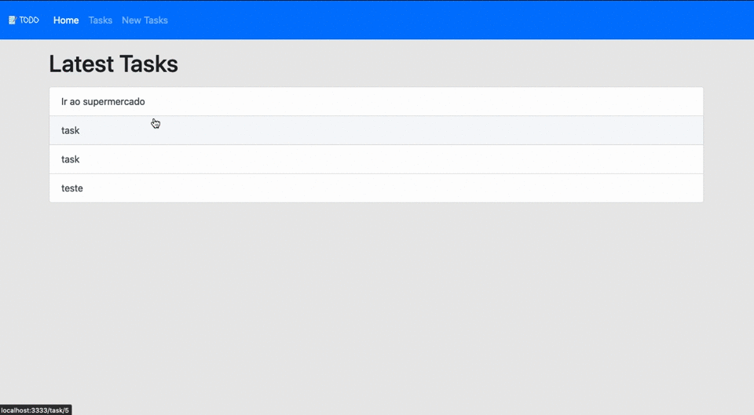

<p align="center">
  
</p>


<h1 align='center'> TODO using AdonisJS </h1>

<p align="center">
  
</p>

This project was created using AdonisJS and its resources as:

- [Session](https://adonisjs.com/docs/4.1/sessions)             
- [Edge template engine](https://adonisjs.com/docs/4.1/views#_templating)
- [Lucid ORM](https://adonisjs.com/docs/4.1/lucid)            
- [Migrations](https://adonisjs.com/docs/4.1/migrations)          

## :rocket: Setup

Install the Adonis CLI if you don't have it installed

Run to command in your terminal
```bash
npm i -g @adonisjs/cli
```

after installed `adonis/cli` clone this repository and run this command in your terminal 

```bash
npm install
```

This project is using the postgres database, if I need to use another one see the installation of your package [here](https://adonisjs.com/docs/4.0/database#_supported_databases)

---
## Configure your database

rename the `.env.example` file to` .env` and change the variables using your database data. Example:

```bash 
  DB_CONNECTION=pg
  DB_HOST=127.0.0.1
  DB_PORT=3306
  DB_USER=root
  DB_PASSWORD=yourpassword
  DB_DATABASE=todoapp
```


---
## 👨🏻‍💻 Migrations

Run the following command to run startup migrations.

```js
adonis migration:run
```

### Done
  Once the installation process is completed, you can cd into the directory and run the following command to start the HTTP server.

```bash 
adonis serve --dev
``` 
---
<p align="center">
  <br>
 developed by pablohdev <br>
  

 
 
 
</p>


